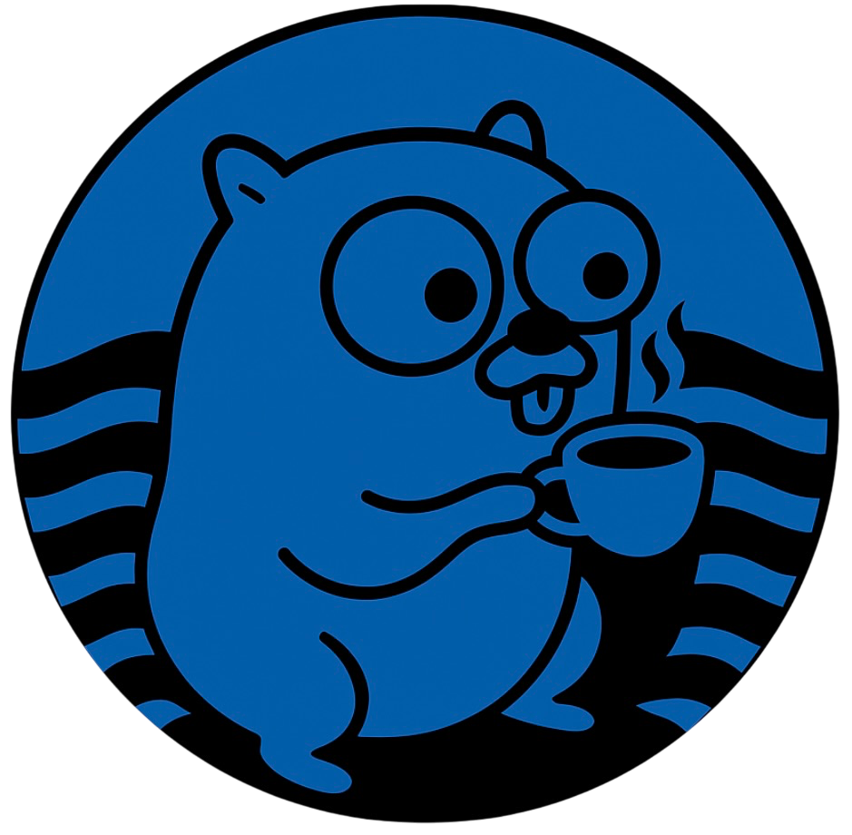

<h1 align="center">
   
</h1>
<p align="center">
  
  
  
</p>
<div align="center">

**Coffee2Go** is a very early-stage Python GUI tool that attempts to convert basic Java code into equivalent Go code.

  <h4>
    <em>Experimental • Educational • Cross-language</em>
  </h4>
</div>
<p align="center">
  <a href="#-idea"><b>🧠 Idea</b></a> •
  <a href="#-features"><b>✨ Features</b></a> •
  <a href="#-input-vs-output-example"><b>📥 Examples</b></a> •
  <a href="#-how-to-run"><b>🚀 Getting Started</b></a>
</p>
<hr>


⚠️ **Disclaimer:** This tool is **not fully functional** yet. It was created as an experimental idea and proof of concept, and many translations are either incomplete, incorrect, or overly simplified. **Manual review and editing is always required.**

<hr>

## 🧠 Idea
The idea behind Coffee2Go is to build a lightweight, beginner-friendly tool that helps visualize and understand the differences between Java and Go syntax. It's primarily aimed at students, hobbyists, or anyone curious about how Java structures might look in Go.

Unlike advanced compilers or transpilers, this tool relies on simple string-based replacements and patterns — not a full parser or AST. Its purpose is more educational than practical.

The GUI is built with Python and Tkinter, so it can run on most systems without any extra dependencies.

<hr>

## ✨ Features
<table>
  <tr>
    <td width="200"><h3 align="center">📁</h3><h3 align="center"><b>File Processing</b></h3></td>
    <td>Load and parse `.java` files</td>
  </tr>
  <tr>
    <td width="200"><h3 align="center">🔄</h3><h3 align="center"><b>Basic Translation</b></h3></td>
    <td>Basic Java-to-Go translation:<br>
    - `System.out.print*` → `fmt.Print*`<br>
    - Translating `if`, `for`, and `while` blocks<br>
    - Primitive variable declarations<br>
    - Java string methods like `.equals()`, `.length()`, `.substring()` get basic Go equivalents<br>
    - Converts class names to Go `struct` definitions (simplified)<br>
    - Optionally uppercase struct field names for export in Go<br>
    - Replaces `try/catch` blocks with comments in Go, noting manual attention is needed</td>
  </tr>
  <tr>
    <td width="200"><h3 align="center">✏️</h3><h3 align="center"><b>Built-in Editor</b></h3></td>
    <td>Built-in code editor: view and modify input/output inside the app</td>
  </tr>
  <tr>
    <td width="200"><h3 align="center">💾</h3><h3 align="center"><b>Save & Export</b></h3></td>
    <td>Save translated Go code to a `.go` file with one click</td>
  </tr>
  <tr>
    <td width="200"><h3 align="center">🌐</h3><h3 align="center"><b>Cross-platform</b></h3></td>
    <td>Cross-platform (Python + Tkinter based)</td>
  </tr>
</table>

<hr>

## 📥 Input vs Output Example
> **Note:** The following is a simple illustration. Real output may require cleanup or fixing by hand.

### Java Input
```java
public class HelloWorld {
    public static void main(String[] args) {
        System.out.println("Hello, Go world!");
    }
}
```

### Go Output
```go
package main
import (
    "fmt"
)
func main() {
    fmt.Println("Hello, Go world!")
}
```

<hr>

## 🚀 How to Run
### Requirements
- Python 3.x
- Tkinter (usually included with standard Python installation)
- No external libraries required

### Launch the app
```bash
python main.py
```
This will open a simple GUI window with file selection, options, and a translation panel.

<hr>

## ⚠️ Limitations
This tool is highly experimental and not intended for serious development use.
- ❌ No support for object-oriented features like inheritance, interfaces, or polymorphism
- ❌ No full parsing — relies entirely on regex and string replacements
- ❌ Complex Java constructs like anonymous classes, lambdas, enums, and streams are ignored
- ❌ Error handling, type checking, and proper code formatting are not implemented
- ❗ Output Go code may not compile or run without modification
- 🧪 Best suited for simple class examples or learning purposes

<hr>

## 🧪 Status
This project is still in a prototype phase and mainly serves as an exploratory tool.

If you're expecting accurate translations for production-level Java code, this is not the right tool (yet 😉).

<hr>

### 🤝 Contributions
This is a casual, open-ended learning project. Contributions are welcome — whether it's bug fixes, improved translation logic, or just suggestions.

Feel free to open an issue or pull request on GitHub.

<hr>

### 📄 Licensed under the Apache License 2.0.
See the LICENSE file for full details.
